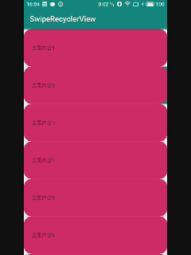

SwipeRecyclerView
---

侧滑菜单很多，对于重复造轮子的问题，主要是没有找到合适的，顺便练练手

* 左滑菜单(水平排列)
    * 支持定义多个菜单
    * 支持定义每个菜单的宽度、背景、图标等
    * 支持图标大小、字体大小、字体颜色等设置
* 事件监听
    * 菜单点击事件
    * item点击事件
    * 侧滑状态(包括展开关闭起始状态，展开关闭结束状态)

### 1. 添加library
Gradle
```
// SwipeRecyclerView基于recyclerview，因此必须添加recyclerview，版本随意
implementation 'androidx.recyclerview:recyclerview:1.0.0'
// 0.0.4以下版本只有支持旧版本的adapter,同时ClickListener和MenuItem在BaseSwipeAdapter下
implementation 'com.jessehu.swiperecyclerview:SwipeRecyclerView:0.1.0'
```

### 使用
#### 1. 布局中添加SwipeRecyclerView
```XML
<androidx.constraintlayout.widget.ConstraintLayout xmlns:android="http://schemas.android.com/apk/res/android"
    xmlns:app="http://schemas.android.com/apk/res-auto"
    xmlns:tools="http://schemas.android.com/tools"
    android:layout_width="match_parent"
    android:layout_height="match_parent">

    <com.jessehu.swiperecyclerview.SwipeRecyclerView
        android:id="@+id/srv_list"
        android:layout_width="0dp"
        android:layout_height="0dp"
        app:layout_constraintBottom_toBottomOf="parent"
        app:layout_constraintLeft_toLeftOf="parent"
        app:layout_constraintRight_toRightOf="parent"
        app:layout_constraintTop_toTopOf="parent" />

</androidx.constraintlayout.widget.ConstraintLayout>
```
#### 2. 创建菜单
```java
MenuItem menuItem = new MenuItem();
// 设置菜单宽度
menuItem.setWidth(300);
// 设置菜单的内边距，仅在菜单宽度自适应的情况下生效，如果设置了Width或者Adapter设置了MenuWidth都将无效
menuItem.setPadding(20);
// 设置菜单名称
menuItem.setTitle("菜单");
// 设置标题字体颜色
menuItem.setTextColor(Color.BLUE);
// 设置菜单标题字体大小
menuItem.setTextSize(10);
// 设置菜单背景色
menuItem.setBgColor(Color.YELLOW);
// 设置菜单背景，如果设置了BgDrawable，BgColor将无效
menuItem.setBgDrawable(getResources().getDrawable(R.drawable.bg_menu));
// 设置图标
menuItem.setIcon(getResources().getDrawable(R.mipmap.ic_launcher));
// 设置图标和标题的间距
menuItem.setIconPadding(20);
// 设置图标位置
menuItem.setIconGravity(Gravity.BOTTOM);
// 设置图标大小，如果不设置，默认为菜单文字高度
menuItem.setIconSize(50);
```
以上属性可以根据自身需要选择设置  
菜单高度由ItemView的高度决定

#### 3. 继承BaseSwipeAdapter
```java
/**
 * 示例
 */
public class OldSwipeAdapter extends BaseOldSwipeAdapter<String> {

    public OldSwipeAdapter(Context mContext, int mLayoutId, List<String> contentData) {
        super(mContext, mLayoutId, contentData);
    }

    @Override
    public void onBindViewHolder(@NonNull BaseOldSwipeAdapter.SwipeHolder holder, String data, int position) {
        TextView titleTv = (TextView) holder.getView(R.id.tv_title);
        titleTv.setText(data);
    }
}
```
1. 构造函数中mLayoutId表示自定义的正常显示的ItemView的layout id
2. 在onBindViewHolder中通过holder.getView获取对应id的view，然后设置对应的数据
3. `BaseSwipeAdapter<T>`构造函数中的`List<T> contentData` 和onBindViewHolder中的`T data`的类型T为自定义数据类型，根据需求自定义

#### 4. 设置Adapter
```java
OldSwipeAdapter swipeAdapter = new OldSwipeAdapter(mContext, R.layout.item_view, contents);
// 设置菜单
swipeAdapter.setMenus(List<MenuItem>);
// 设置菜单宽度，如果在创建菜单的时候没有设置宽度，将会使用该宽度，如果菜单宽度都一样，可以使用该属性统一设置
swipeAdapter.setMenuWidth(200);
SwipeRecyclerView listView = findViewById(R.id.srv_list);
listView.setAdapter(swipeAdapter);
```

#### 5. 设置监听事件
```java
// 设置菜单点击事件
swipeAdapter.setOnMenuItemClickListener(new OnMenuItemClickListener() {
    @Override
    public void onClick(View view, int itemPosition, int menuPosition) {
        Toast.makeText(mContext, titles.get(menuPosition) + contents.get(itemPosition), Toast.LENGTH_SHORT).show();
    }
});

// 设置item点击事件
swipeAdapter.setOnItemClickListener(new OnItemClickListener() {
    @Override
    public void onClick(View view, int position) {
        listView.closeMenu();
        Toast.makeText(mContext, contents.get(position), Toast.LENGTH_SHORT).show();
    }
});

// 设置菜单滑动状态监听
listView.setOnMenuStatusListener(new SwipeRecyclerView.OnMenuStatusListener() {
    @Override
    public void onOpenStart(View itemView, List<MenuView> menuViewList, int position) {
        Log.i(TAG, "onOpenStart: " + contents.get(position));
        itemView.setBackground(getResources().getDrawable(R.drawable.bg_open));
    }

    @Override
    public void onOpenFinish(View itemView, List<MenuView> menuViewList, int position) {
        Log.i(TAG, "onOpenFinish: " + contents.get(position));
    }

    @Override
    public void onCloseStart(View itemView, List<MenuView> menuViewList, int position) {
        Log.i(TAG, "onCloseStart: " + contents.get(position));
    }

    @Override
    public void onCloseFinish(View itemView, List<MenuView> menuViewList, int position) {
        Log.i(TAG, "onCloseFinish: " + contents.get(position));
        itemView.setBackground(getResources().getDrawable(R.drawable.bg_normal));
    }
});
```
注意：点击事件是Adapter回调的而侧滑状态是SwipeRecyclerView回调的  
在进行其他操作之前，请先关闭已打开的菜单`listView.closeMenu()`

最后送上丑图一张  
